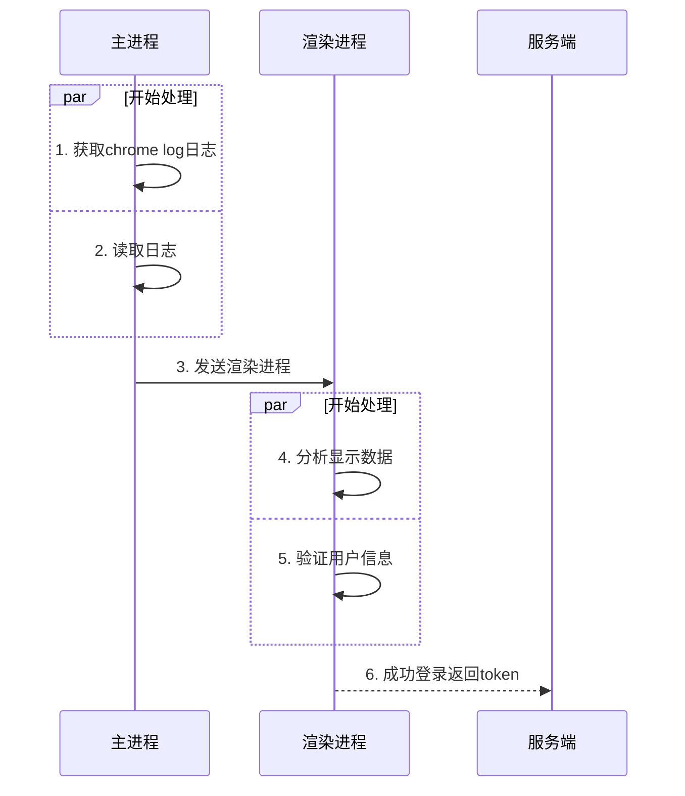

# Electron 主进程

```mermaid
sequenceDiagram
    par 开始处理
        主进程 ->> 主进程 : 1. 获取chrome log日志
    and
        主进程 ->> 主进程 : 2. 读取日志
    end

    主进程 ->> 渲染进程 : 3. 发送渲染进程

    par 开始处理
        渲染进程 ->> 渲染进程 : 4. 分析显示数据
    and
        渲染进程 ->> 渲染进程 : 5. 验证用户信息
    end

    渲染进程 -->> 服务端 : 6. 成功登录返回token
```